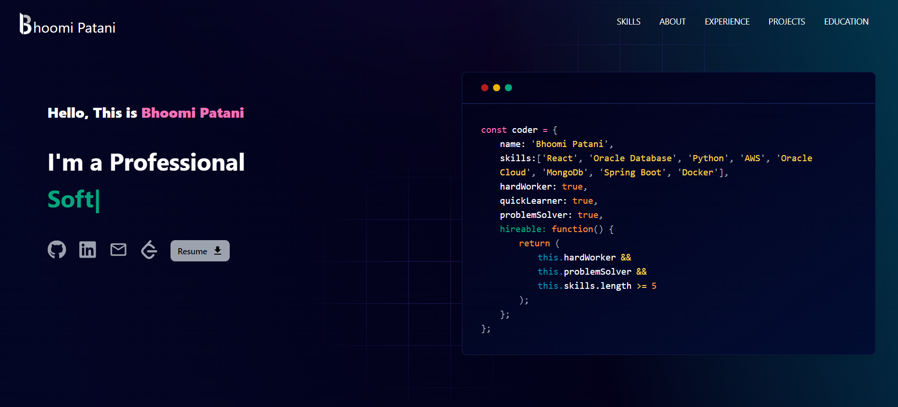
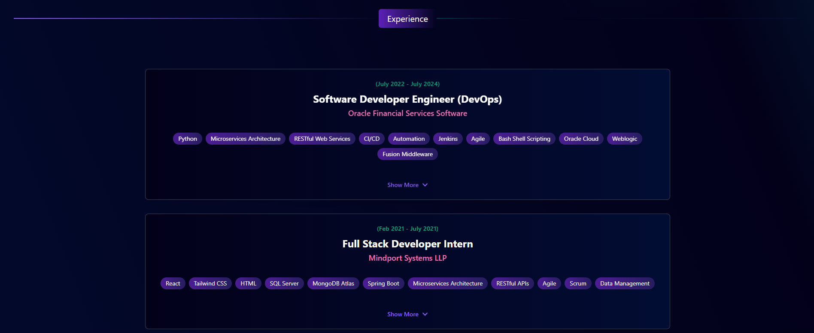
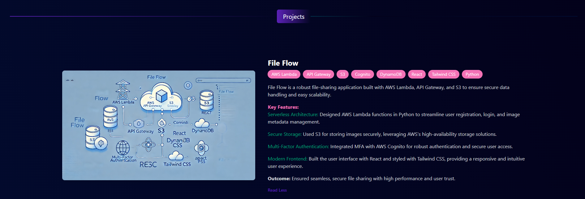

# 🌐 Bhoomi Patani | Portfolio Website

Welcome to the source code for [bhoomipatani.netlify.app](https://bhoomipatani.netlify.app)! This portfolio website showcases my journey in computer science, highlighting my technical skills, projects, and professional experience in DevOps and full-stack development. Built with a responsive design and smooth navigation, it provides a comprehensive look at my background and accomplishments.

## 🖥️ Live Demo

Explore the live version of my portfolio [here](https://bhoomipatani.netlify.app).

---

## 📸 Screenshots

### Hero Section


### Experience Section


### Project Section


---

## 📂 Table of Contents

- [Features](#features-💡)
- [Installation](#installation-⬇️)
- [Getting Started](#getting-started-🎯)
- [Customizing Data](#customizing-data-📝)
- [Tech Stack](#tech-stack-🛠️)
- [Packages Used](#packages-used-📦)
  
---

## Features 💡

- **Hero Section**: Introduction and links to explore my work.
- **About Me**: Overview of my background, skills, and professional interests.
- **Experience & Skills**: Highlights of my work experience and technical skills.
- **Projects**: Showcases selected projects demonstrating my expertise in DevOps and full-stack development.
- **Education & Blog**: Academic achievements and selected blog entries.

---

## Installation ⬇️

To set up this project locally, follow these steps:

1. **Clone the repository**:
   ```bash
   git clone https://github.com/Bhoomipatani/Portfolio-Website.git
   ```

2. **Navigate to the project directory**:
   ```bash
   cd Portfolio-Website
   ```

3. **Install dependencies**:
   ```bash
   npm install
   ```

4. **Start the development server**:
   ```bash
   npm start
   ```

5. Open [localhost:3000](http://localhost:3000) in your browser to view the website locally.

---

## Getting Started 🎯

1. **Fork the repository** on GitHub to create your own copy.
2. **Clone the forked repository**:
   ```bash
   git clone https://github.com/yourusername/Portfolio-Website.git
   ```
3. **Edit the project files** to personalize content and images.

---

## Customizing Data 📝

To personalize the information displayed on your website, modify the data in the `utils/data` folder. This folder includes files for customizing your personal information, project details, and links.

### Example
```javascript
export const personalData = {
  name: "Bhoomi Patani",
  profile: "/profile.png",
  designation: "Full-Stack Developer",
  description: "Hi, I’m Bhoomi Patani, a passionate software developer...",
  email: "bpatani@uci.edu",
  phone: "+9496787156",
  address: "Irvine, California",
  github: "https://github.com/Bhoomipatani",
  linkedIn: "https://www.linkedin.com/in/bhoomipatani",
};
```

---

## Tech Stack 🛠️

- **Frontend**: HTML, CSS, JavaScript
- **Styling**: CSS with custom styles and responsive design
- **Deployment**: Netlify

---

## Packages Used 📦

This project utilizes the following packages:

- **react-icons**: For icons across the site.

---

Feel free to explore the code, submit suggestions, or fork this repository to create your own portfolio website!
